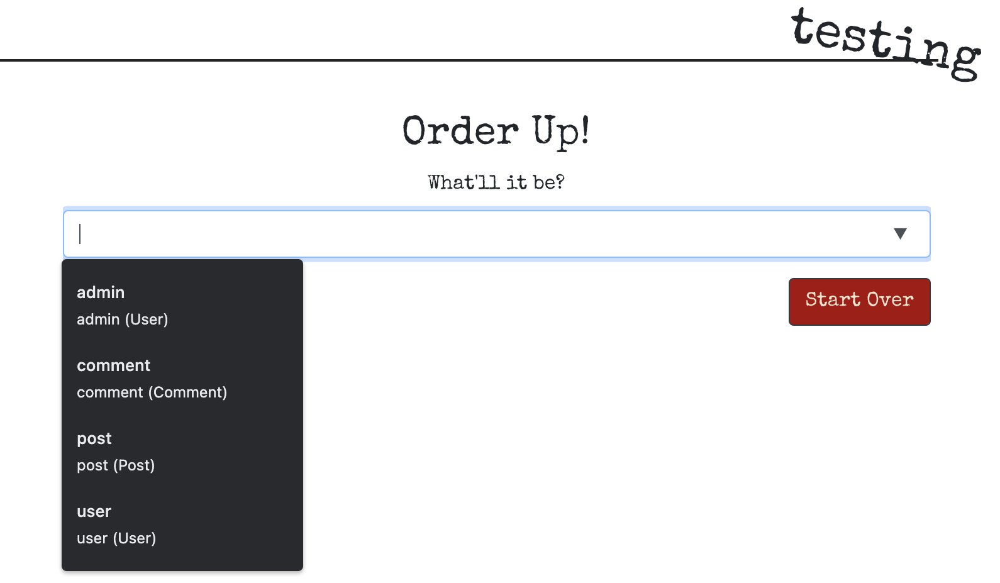
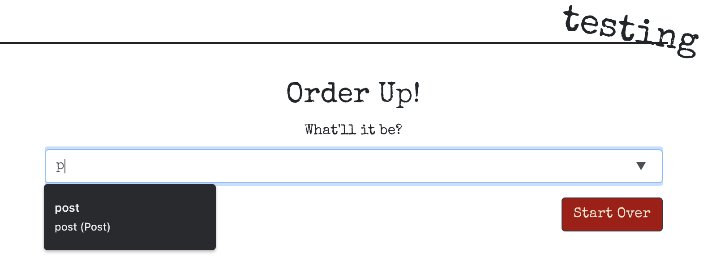
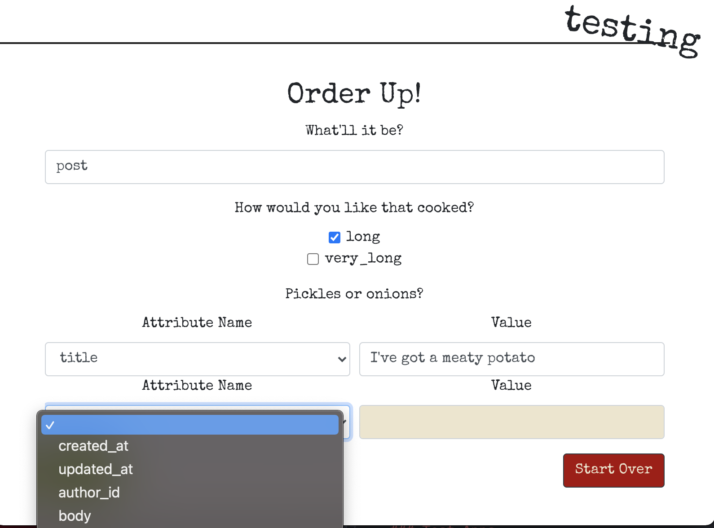
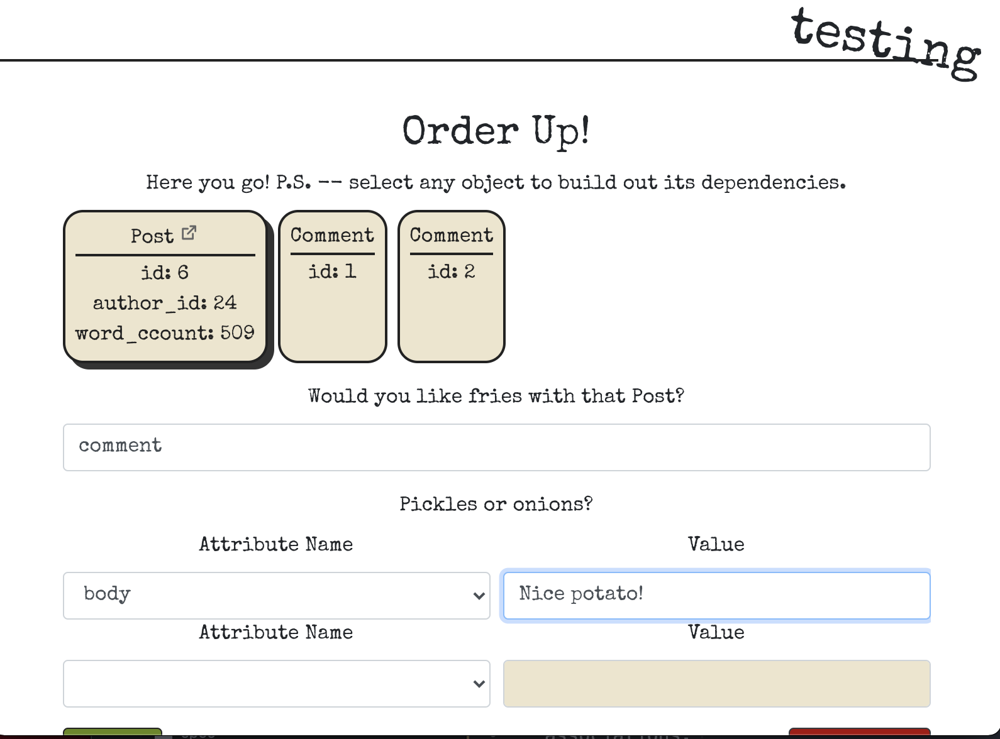
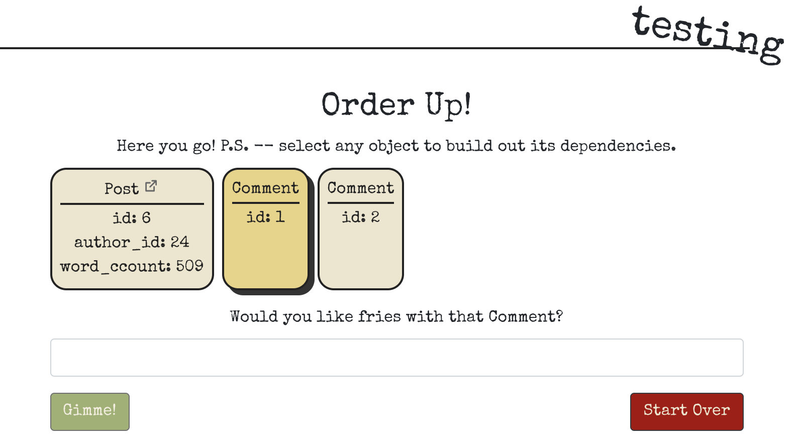

# factory_burgers

A UI for [thoughtbot/factory_bot](https://github.com/thoughtbot/factory_bot)

FactoryBurgers provides a front-end, non-developer usable, a la carte ordering experience for all of your defined factories. Just as FactoryBot makes it easy to create test data for automated tests, FactoryBurgers makes it easy to create testing data for manual testing environments. The primary intended use case is for manual testing including developers poking around as well as a QA team being able to easily create test scenarios.

You're free to use this in production, of course, but I'm not sure why you would want to do that.

FactoryBurgers currently is designed to work with Rails apps, but expanding to more generic ruby applications would be nice!

If you don't use FactoryBot, check it out! Using FactoryBot and FactoryBurgers can be a useful pattern even if you don't use FactoryBot for automated testing. However, there's a lot of synergy that comes from allowing manual testing to use the same factories, traits, and associations that are defined in your factories and models.

## Usage

For examples, look at [the test apps](test_apps)

### 1. Install

Add `factory_burgers` to your Gemfile under any environments you wish to use it on. Typically this might include `:development` and, if you use it, `:staging`. **Be very careful** if you add this to production as a user with access to FactoryBuurgers can create arbitrary admin users with arbitrary passwords, if you have factories that allow this.

### 2. Mount FactoryBurgers

To access the FactoryBurgers UI at http://YOUR_APP/factory_burgers, add the following to your `config/routes.rb` file:

```ruby
  mount FactoryBurgers::App, at: "/factory_burgers", as: "factory_burgers"
```

You may now reference the factory burgers path in controllers and views as `factory_burgers_url` or `factory_burgers_path`.

### 3. That's it!

You can now start using FactoryBurgers to create objects manually via your defined factories.

From the main page, you can select any factories that you have defined.



The input is a datalist, so you can type to filter your factories if you have a lot of them to scroll through!



Once you select a factory, you can select any traits that are defined on that factory. You can also provide values for any of the attributes that will override any factory defaults.



Press "Gimme!", and FactoryBurgers will cook up your order in no time and show you the result.


Your first order will be selected by default, and for any selected object you can repeat the process for any of its associations.



At this point you can select any of the ordered objects and repeat the process as long as you wish.




Click "Start Over" to clear the orders from the page, but the objects will still be persisted in your database.

## Customization

In the example above, the `Comment` model is using the default data presenter, which displays an object's `id` and `name`, if it has one, field. The `Post` model, however, uses a custom presenter that displays  more information and provided a link to that resource in your application. That's a tasty burger!

You can define custom presenters using a block or a class. In both cases, your may define:

* `type`: What is this object? This string will be display at the top of each card in the UI. Default: the object's class name.
* `attributes`: What data to display for this object. These can be anything you want, including derived data (they don't need to just be attributes that map to db columns!). Default: a Hash with `id` and `name`, if your object has either or both of these columns.
* `link_path`: The path to this object in your application. The user can click on a link icon in the card title to open that path in a new tab. Default: `nil` (no link).

To use a custom presenter, use one of the two forms of `FactoryBurgers::Presenters.present`. A good place to put this code is in `config/initializers/factory_burgers.rb`

#### 1. Provide definitions in a block.

You can call `type`, `attributes`, and `link_path` inside this block. For any of these calls, provide a block that accepts the object that was built as a single argument and returns the value you want.

```ruby
FactoryBurgers::Presenters.present("Post") do
  attributes do |post|
    {
      id: post.id,
      author_id: post.author_id,
      word_ccount: post.body.split(/\s+/).count,
    }
  end

  link_path { |post| Rails.application.routes.url_helpers.post_path(post) }
end
```

#### 2. Provide a presenter class.

```ruby
FactoryBurgers::Presenters.present "User", with: FactoryBurgers::Presenters::UserPresenter
```

To define a presenter as a class, create a class that inherits from FactoryBurgers::Presenters::Base and overrides any of `type`, `attributes`, and `link_path` provided by the [base class](lib/factory_burgers/presenters/base.rb).

Within these methods, you may access the built object as `object`. For readability, you can use the `presents` class method to alias this method to a more appropriate name (e.g. `user` in this example).

```ruby
class FactoryBurgers::Presenters::UserPresenter < FactoryBurgers::Presenters::Base
  presents :user

  def attributes
    {
      id: user.id,
      name: user.full_name,
      login: user.login,
      email: user.email,
    }
  end

  def link_path
    Rails.application.routes.url_helpers.user_path(user)
  end
end
```

Go ahead and use the `FactoryBurgers::Presenters` namespace for your presenter classes, that's what it's there for!

### A note on sequences

Some models have uniqueness-validated fields, such as `login` on `User`. FactoryBot allows you to avoid conflicts by defining sequences, such as

```ruby
sequence :user_login do |ii|
  "somebody#{ii}"
end
```

This works great in a test environment, where your database actions are rolled back in one form or another; the next run of your test suite starts these sequences over from square 1.

Unfortunately, this is problematic for our use case, as we're creating persisted records without any kind of rollback for manual use. This means that new threads and restarted servers will attempt to start these sequences from 1, and you will run into uniqueness conflicts.

To get around this, `FactoryBot` provide a `FactoryBurgers::Cheating` module, that allows you to specific sequences you wish to advance. To use it, pass the sequence name, the class that contains the uniqueness validation or constraint, and the name of the field on which that validation lives. For example:

```ruby
FactoryBurgers::Cheating.advance_sequence(:user_login, User, :login)
```

`FactoryBot` will use some [Ruby trickery](lib/factory_burgers/sequence_cheater.rb) to detect how your sequence is defined and what it produces, will query the database for matching values, and advance the sequence as far as it detects is necessary to avoid uniqueness violations.

In a future iteration, `FactoryBot` may try to automatically detect these for any class that is ordered so you don't have to add these references to `Cheater`. `FactoryBot` may also add the ability to manually specify how far to advance these sequences using dynamic code.

## Development

### Testing

```
make test
```

This runs `rspec`, `eslint`, and `rubocop`.

### UI

Located at [factory_burgers-ui](factory_burgers-ui), the UI is built in React with npm. Run `npm run build` from that directory to build it; it will automatically copy the build into the gem assets folder.

### Middleware

The faithful code taking your orders and handing you your fries are Rack middleware applications located at [lib/factory_burgers/middleware](lib/factory_burgers/middleware).

* `FactoryBurgers::Middleware::Static` serves the built front-end assets using `Rack::Static`
* `FactoryBurgers::Middleware::Data` provides the first page with the data it needs to present the menu options to the user.
* `FactoryBurgers::Middleware::Build` handles the orders and returns association data in the response.

### Test Apps

#### Rails 6.1

Created with:

```
rails new rails-6.1 --api --minimal
```
